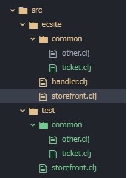

### ファイル構成の説明
- フォルダ構成  
　

- project.cljの変更
下記のコードをproject.cljに追加します。（:test-1やtest-2を任意のkeywordへ変更できます）
```
  :test-paths ["src"]
  :test-selectors {:default (complement :all)
   　　　　　    　:user001 :user001
  　　　　　    　 :user002 :user002
　　　　　　　　:all (fn[_] true)}
```

- .travis.yml の追加
scriptのコマンドはlein test $T_KEYで環境変更を貰って lein test で実施します。

- travis-ci.comの管理画面に変数の追加　
  - 管理画面右上のiconをクリック　＞　settings　＞　travis-test（branch）のsettings　＞　Environment Variables
  - NAME = T_KEY　　BRANCH=travis-test（選択しなければ全部branchでもよいです）       
  - VALUE=:zheng （「:」が付いてます。このkeywordは project.cljに定義したtest-selectorsの一つです）
  または VALUE=test.common.ticket （namespaceを設定する場合、travis_test.cljにあるdeftestを全部実施されます）


### テストコードの説明

- テスト実施できる粒度下記のように分けられています
  - lein test
    - parameterなしでdefaultを実施したら、:test-pathsで指定したパス配下にすべてcljファイルにある deftest ファンクションをテストします。
  - lein test test.common.ticket
    - テストファイルのnamespaceを指定したら、該当namespaceに定義した deftestをすべてテストします。
  - lein test :user001
    - keywordを指定したら、deftest ^:user001 のような該当keywordを明確標記したファンクションをテストします。
  - lein test :only test.common.ticket/function-name 　
    - namespaceとfunction-nameを指定したら、指定したnamespaceにある function-nameのみテストします。
  - 組み合わせテストも可能です
```
   lein test :user001 :user002
   //:user001 と :user002 を標記した deftestを実施する

   lein test :user003 test.common.ticket
   //:user003を標記したdeftestとnamespace test.common.ticketにあるすべてdeftestを実施する

   lein test test.common.ticket test.common.other
   //namespace test.common.ticketとtest.common.otherにあるすべてdeftestを実施する
```

- テスト実施を分けるため、project.cljに下記のようなコードを追加します
```
  :test-paths
  :test-selectors {:default (complement :all)
  　　　　　    　 :user001 :user001
  　　　　　    　 :user002 :user002
  　　　　　    　 :user003 :user003
　　　　　　　　:all (fn[_] true)}
```

- テストファンクションの構成

  ```
  　(deftest ^keyword function-name)
   例：
  　(deftest ^:user001 function-A
      (is (= 2 1))
     )
  ```
  - keyword は test-selectorsに定義したkeywordの一つを選べる
　- function-nameは任意
